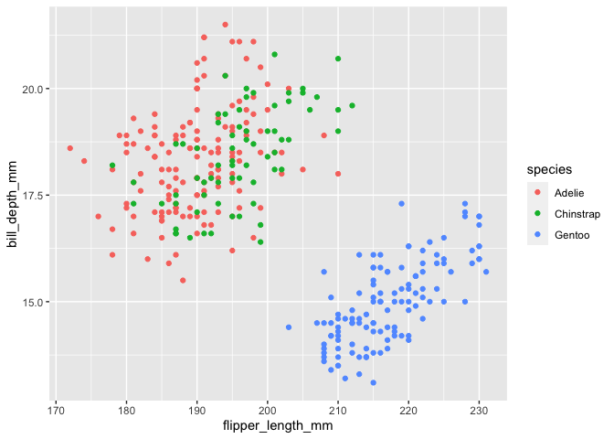

Homework 1
================
Hanyu Lu

This is my solution to HW1.

``` r
library(tidyverse)
```

    ## ── Attaching packages ───────────────────────────────────────────────────── tidyverse 1.3.0 ──

    ## ✓ ggplot2 3.3.2     ✓ purrr   0.3.4
    ## ✓ tibble  3.0.3     ✓ dplyr   1.0.2
    ## ✓ tidyr   1.1.2     ✓ stringr 1.4.0
    ## ✓ readr   1.3.1     ✓ forcats 0.5.0

    ## ── Conflicts ──────────────────────────────────────────────────────── tidyverse_conflicts() ──
    ## x dplyr::filter() masks stats::filter()
    ## x dplyr::lag()    masks stats::lag()

``` r
library(ggplot2)
```

## Problem 1

Create a data frame with the specified elements.

``` r
prob1_df=
  tibble(
    samp = rnorm(10),
    samp_gt_0 = samp > 0,
    char_vec = c("a", "b", "c", "d", "e", "f", "g", "h", "i", "j"),
    factor_vec = factor(c("low", "low", "low", "mod", "mod", "mod", "mod", "high", "high", "high"))
  )
```

Take the mean of each variable in my data frame.

``` r
mean(pull(prob1_df, samp))
```

    ## [1] 0.5983079

``` r
mean(pull(prob1_df, samp_gt_0))
```

    ## [1] 0.7

``` r
mean(pull(prob1_df, char_vec))
```

    ## Warning in mean.default(pull(prob1_df, char_vec)): argument is not numeric or
    ## logical: returning NA

    ## [1] NA

``` r
mean(pull(prob1_df, factor_vec))
```

    ## Warning in mean.default(pull(prob1_df, factor_vec)): argument is not numeric or
    ## logical: returning NA

    ## [1] NA

I can take the mean of numbers and logical but not character or factor.

``` r
as.numeric(pull(prob1_df, samp))
as.numeric(pull(prob1_df, samp_gt_0))
as.numeric(pull(prob1_df, char_vec))
as.numeric(pull(prob1_df, factor_vec))
```

I have numerical outputs for numbers, logical, and factor variables, but
not for characters. Mean does not exist for any variables not converted
to numerical values.

``` r
as.numeric(pull(prob1_df, samp_gt_0)) * pull(prob1_df, samp)
```

    ##  [1] 2.0141261 0.0000000 0.3415489 0.4590215 1.1482269 1.1952556 0.0000000
    ##  [8] 1.7953447 0.0000000 0.4033287

``` r
as.factor(pull(prob1_df, samp_gt_0)) * pull(prob1_df, samp)
```

    ## Warning in Ops.factor(as.factor(pull(prob1_df, samp_gt_0)), pull(prob1_df, : '*'
    ## not meaningful for factors

    ##  [1] NA NA NA NA NA NA NA NA NA NA

``` r
as.numeric(as.factor(pull(prob1_df, samp_gt_0))) * pull(prob1_df, samp)
```

    ##  [1]  4.02825227 -0.08797488  0.68309773  0.91804299  2.29645390  2.39051110
    ##  [7] -0.66603998  3.59068947 -0.61975818  0.80665735

After factors are converted to numbers, they can do arithmetic
operations including multiplication. However, factors are not eligible
for multiplication.

## Problem 2

First, load the penguins dataset.

``` r
data("penguins", package = "palmerpenguins")
```

  - There are several variables in the penguins dataset that includes
    bill\_depth\_mm, bill\_length\_mm, body\_mass\_g,
    flipper\_length\_mm, island, sex, species, year. Among those
    variables, bill\_length\_mm has range ( 32.1, 59.6 ),
    bill\_depth\_mm has range ( 13.1, 21.5 ), flipper\_length\_mm has
    range ( 172, 231 ), year has range ( 2007, 2009 ), body\_mass\_g has
    range ( 2700, 6300 ), sex has levels female, male, species has
    levels Adelie, Chinstrap, Gentoo, and island has levels Biscoe,
    Dream, Torgersen.

  - The dataset has 344 rows and 8 columns.

  - The mean flipper length is 200.9152047.

  - Make a scatterplot of flipper length (y) vs bill length (x) with
    points colored in accordance with different species.

<!-- end list -->

``` r
ggplot(penguins, aes(x = flipper_length_mm, y = bill_depth_mm, color = species)) + geom_point()
```

<!-- -->

``` r
ggsave("first_scatterplot_hl3439.png")
```

    ## Saving 7 x 5 in image
